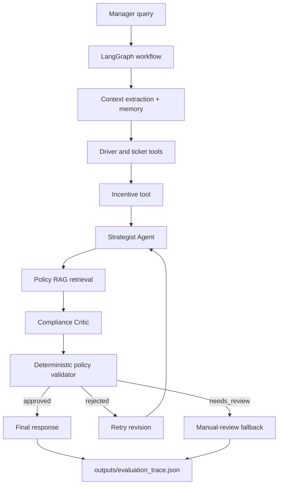

# Driver Retention Copilot

MCP-style, policy-aware multi-agent decision-support system for FREENOW Driver Relationship Managers. It retrieves driver data, support tickets, policy evidence, and incentive options; generates a retention strategy; validates it against deterministic guardrails; self-corrects if needed; and saves a JSON evaluation trace.

## Architecture



## Folder Structure

The project follows the requested layout: `app/`, `agents/`, `graph/`, `llm/`, `tools/`, `rag/`, `state/`, `mcp_server/`, `evaluation/`, `data/`, `outputs/`, plus `README.md`, `design_doc.md`, `requirements.txt`, and `.env.example`.

## Setup

```bash
cd driver-retention-copilot
python3 -m venv .venv
source .venv/bin/activate
pip install -r requirements.txt
cp .env.example .env
```

Fill in `.env`:

```env
OPENROUTER_API_KEY=your_key_here
MODEL_NAME=chosen_openrouter_model_id
```

`MODEL_NAME` is intentionally configurable because OpenRouter model availability changes. Choose a model with strong JSON output, instruction following, and compliance reasoning.

## Policy Ingestion

Embeddings use local `sentence-transformers`, not OpenRouter.

```bash
python -m rag.ingest_policy
```

If Chroma or sentence-transformers are not installed, the retriever falls back to deterministic keyword retrieval over the PDF text, but production/demo setup should run ingestion.

## CLI

```bash
python -m app.main --session-id demo-1 --query "Driver Maria D-456 just called. She waited in the airport queue for two hours only to be given a 1.5km trip. She's furious as this has happened multiple times. How do we handle this?"
```

Demo shortcut:

```bash
python -m app.main --session-id demo-1 --demo
```

Interactive memory mode:

```bash
python -m app.main --session-id demo-1 --interactive
```

The real data maps Maria to `D-LON-001`, so the system resolves the prompt's `D-456` by name when that ID is absent.

## Streamlit UI

```bash
streamlit run app/ui_streamlit.py
```

The UI shows the driver summary, support evidence, strategist plan, critic verdict, final recommendation, and trace.

## Tests and Evaluation

Offline tests do not require an OpenRouter key:

```bash
pytest evaluation/
```

Run evaluation:

```bash
python -m evaluation.run_eval
```

`evaluation/run_eval.py` always runs the deterministic seeded self-correction case and saves `outputs/evaluation_trace.json`. It runs live workflow cases only when `OPENROUTER_API_KEY` and `MODEL_NAME` are configured.

## Example Behavior

For Maria's repeated airport short-fare issue, the Strategist may initially propose a high-value recovery. The Critic enforces the UK policy: Gold airport short-fare compensation is capped at 25 GBP, and Silver/Bronze at 15 GBP. Over-cap compensation is rejected, the plan is revised, and the final response is approved only after validation.

## MCP-Style Tooling

`tools/` contains the actual business and data logic. `mcp_server/server.py` imports and exposes those same functions through FastMCP when available. It does not duplicate tool logic.

For this implementation, the graph calls local Python tool functions directly for reliability and simplicity. The MCP server exposes the same tool layer as an MCP-compatible interface, making the system MCP-ready without duplicating business logic.

## Known Limitations

- The bundled dataset is small and London-only.
- The production graph uses local tool calls rather than routing every tool call through MCP.
- RAG has a keyword fallback for environments without Chroma installed.
- The deterministic policy table currently covers the hard rules visible in the provided policy PDF.
- Live LLM behavior depends on the configured OpenRouter model.

## Future Improvements

- Replace local file memory with a database-backed checkpointer.
- Add richer semantic ticket retrieval.
- Add observability around LLM latency, rate limits, and validation failures.
- Expand `policy_rules.py` as more policy documents are ingested.
- Route agent tools through MCP in production.
